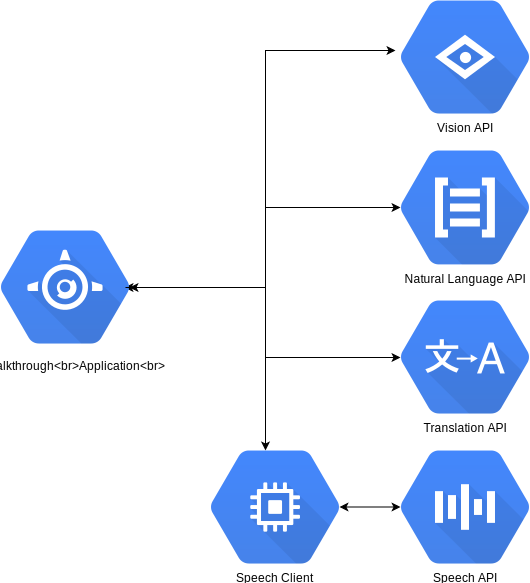

*\*This is not an official GCP repository*

# Google Cloud ML Walkthrough Demo

## Introduction
This web application integrates [Google Cloud Vision](https://cloud.google.com/vision/), [Google Cloud Speech](https://cloud.google.com/speech-to-text/), [Google Cloud Translate](https://cloud.google.com/translate/), and [Google Cloud Natural Language](https://cloud.google.com/natural-language/) with [WebRTC](https://webrtc.org/) as a audio/video source.

### Architecture


## Pre-Requisites
1. Need a Google Cloud Platform account

## Setup
1. Create [GCP Project](https://cloud.google.com/resource-manager/docs/creating-managing-projects)
1. Activate Google Cloud Shell
1. Set your session to the current project
	```
	gcloud config set project <PROJECT NAME>
	```
1. Enable Compute Engine, Vision, Speech, Translate, and Natural Language APIs
	```
	 gcloud services enable compute.googleapis.com vision.googleapis.com speech.googleapis.com translate.googleapis.com language.googleapis.com vision.googleapis.com
	```
1. Create an [API key](https://cloud.google.com/docs/authentication/api-keys)

### Speech Client Compute Engine
This application uses [Google Cloud Speech streaming API](https://cloud.google.com/speech-to-text/docs/streaming-recognize). In order to stream audio from the web application to the Speech API, you will need to create a GCE instance to setup a secure web socket. This was originally setup using the [Speaking with a Webpage](https://codelabs.developers.google.com/codelabs/speaking-with-a-webpage/index.html?index=..%2F..%2Findex#0) codelab.

1. Create a micro GCE instance
	```
	gcloud beta compute --project=$(gcloud config get-value project) instances create speech-client --zone=us-east1-b --machine-type=n1-standard-1 --subnet=default --scopes=https://www.googleapis.com/auth/cloud-platform --tags=https-server --image=debian-9-stretch-v20180611 --image-project=debian-cloud --boot-disk-size=10GB --boot-disk-type=pd-standard --boot-disk-device-name=speech-client
	```
1. SSH into the [new instance](http://console.cloud.google.com/compute/instances)
1. Install git and maven
	```
	sudo apt-get update
	sudo apt-get install -y maven openjdk-8-jdk git
	```
1. In order to access the speech client, you will need to open a port in the Firewall
	```
	gcloud compute firewall-rules create dev-ports --allow=tcp:8443 --source-ranges=0.0.0.0/0
	```
1. Clone this project
	```
	git clone https://github.com/tfrantzen/gcp-ml-walkthrough.git
	```
1. Open directory
	```
	cd gcp-ml-walkthrough/streaming-client/
	```
1. Deploy application
	```
	sudo mvn clean jetty:run
	```

### ML Walkthrough Application
1. Open the Google Cloud Shell
1. Clone project
	```
	git clone https://github.com/tfrantzen/gcp-ml-walkthrough.git
	```
1. Open directory
	```
	cd gcp-ml-walkthrough/client/
	```
1. Install dependencies
	```
	npm install
	```
1. Collect GCE IP Address and API Key
1. Edit public\js\app.js, update variables on line 1 and 2
	```
	...
	var apiKey = '<API_KEY>';
	var speechApiIP = '<GCE_INSTANCE_EXTERNAL_IP>';


	var translateUri = `https://translation.googleapis.com/language/translate/v2?ke...
	```
1. Deploy application
	```
	npm start
	```
1. Open the web preview
	- You will need to navigate your speech-client GCE instance first to accept the self signed certificate


## Sources
1. https://codelabs.developers.google.com/codelabs/speaking-with-a-webpage/index.html?index=..%2F..%2Findex#0
1. https://webrtc.github.io/samples/
1. https://github.com/GoogleCloudPlatform


## Docker containers
The applications can also be containerised. Each application (client and streaming-client) have Dockerfiles.

1. Streaming Client
As this is just a demo we dockerise the app and run it via maven/jetty.

For example:
docker build -t streaming-client .
docker tag streaming-client gcr.io/<PROJECT_ID>/streaming-client
docker push gcr.io/<PROJECT_ID>/streaming-client

You can then reference the container when creating a GCP VM instance.
Note this app has a built in self signed certificate and the HTTPS port must be open in the firewall. This is required for the secure websocket connection from the browser for streaming the audio.

2. Client

docker build -t client .
docker tag streaming-client gcr.io/<PROJECT_ID>/client
docker push gcr.io/<PROJECT_ID>/client

To run the client you can execute the following command from Cloud Shell and use Web Preview to access the site on port 8080 (which is the default).

docker run -p 8080:8080 -e APIKEY=<API_KEY>  -e IPADDR=<STREAMING CLIENT IP ADDR>  gcr.io/<PROJECT_ID>/client

Access to the camera/audio works because it is being invoked in a "localhost" scenario.

(The container also supports a PORT environment variable that defaults to 8080)

If you want to run this client container as a GCP VM you'll need to use HTTPS otherwise the browser will not allow access to the camera/audio.  I achieved this in my GCP project by using a HTTPS Load Balancer which terminates at the LB and carries on with HTTP on port 80.  In this case, also configure the PORT=80 env variable when running the container.  

Another option is to run a self signed certificate with Node Express over HTTPS, but I haven't tried it.
